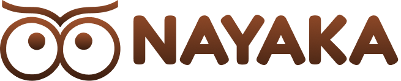

<div align="center">

  

  # NAYAKA
  ### *Bermain untuk Melihat Lebih Baik*

  **Platform Inovasi Ekosistem Terapi Ambliopia Berbasis *Dichoptic Game Training*, Kacamata Anaglif 3D, dan Pemantauan AI**

  [](https://nextjs.org/)
  [](https://react.dev/)
  [](https://tailwindcss.com/)
  [](https://www.typescriptlang.org/)
  [](https://turbo.build/)

  <p align="center">
    <a href="#-tentang-nayaka">Tentang NAYAKA</a> •
    <a href="#-tantangan--solusi">Tantangan & Solusi</a> •
    <a href="#-fitur-unggulan">Fitur Utama</a> •
    <a href="#-kelengkapan-ekosistem">Ekosistem</a> •
    <a href="#-dukungan-medis">Dukungan Medis</a> •
    <a href="#-paket-kemitraan">Paket Kemitraan</a> •
    <a href="#-panduan-instalasi">Memulai</a>
  </p>

</div>

---

## 🌟 Tentang NAYAKA

**NAYAKA** adalah platform terapi ambliopia (*lazy eye* / mata malas) masa depan yang dirancang khusus untuk meningkatkan kepatuhan terapi anak-anak melalui pendekatan *gamified dichoptic training*.

Berbeda dari metode konvensional *patching* (menutup mata sehat) yang sering menimbulkan ketidaknyamanan fisik, rasa rendah diri pada anak, dan resistensi tinggi yang berujung pada kegagalan terapi, NAYAKA menghadirkan **terapi binokular interaktif** yang menyenangkan. Dengan menggabungkan teknologi perangkat lunak adaptif, kacamata anaglif ramah lingkungan, kecerdasan buatan (*Computer Vision AI*), dan buku catatan terapi, NAYAKA menjadi jembatan kolaborasi antara dokter spesialis mata, pasien anak, dan orang tua.

---

## 💡 Tantangan & Solusi

```
┌─────────────────────────────────────────────────────────────┐
│               METODE KONVENSIONAL (PATCHING)                │
│  ❌ Mata sehat ditutup total menggunakan plester patch      │
│  ❌ Anak merasa terkucilkan, risih, dan tidak percaya diri   │
│  ❌ Kepatuhan rendah (compliance drop rate > 50%)           │
│  ❌ Tidak melatih fungsi penglihatan binokular kedua mata   │
└──────────────────────────────┬──────────────────────────────┘
                               │
                               ▼
┌─────────────────────────────────────────────────────────────┐
│                 PENDEKATAN INOVASI NAYAKA                   │
│  ✅ Stimulasi kedua mata secara serentak (Dichoptic)        │
│  ✅ Pengalaman interaktif melalui game edukatif di tablet   │
│  ✅ Kepatuhan tinggi karena anak merasa sedang bermain      │
│  ✅ Otak dilatih kembali menyatukan input visual kedua mata │
│  ✅ Pemantauan kepatuhan real-time menggunakan sensor AI    │
└─────────────────────────────────────────────────────────────┘
```

---

## 🚀 Fitur Unggulan

<table width="100%">
  <tr>
    <td width="50%" valign="top">
      <h3>🎮 1. Dichoptic Game Training</h3>
      <p>Metode terapi neuro-vision mutakhir di mana mata sehat dan mata malas menerima stimulasi visual dengan frekuensi spasial dan elemen game yang terpisah. Hal ini memaksa korteks visual otak untuk mengaktifkan kembali fusi binokular kedua mata secara bersamaan.</p>
    </td>
    <td width="50%" valign="top">
      <h3>🎚️ 2. Adaptive Contrast Calibration</h3>
      <p>Algoritma cerdas yang secara bertahap menyesuaikan kontras visual antara mata dominan dan mata ambliopik. Menurunkan kontras mata sehat dan memaksimalkan kontras mata malas hingga tercapai keseimbangan input visual sebelum fusi penuh.</p>
    </td>
  </tr>
  <tr>
    <td width="50%" valign="top">
      <h3>🤖 3. AI Compliance Monitoring</h3>
      <p>Fitur pengawasan otomatis berbasis <em>Computer Vision</em> menggunakan kamera tablet. Model AI mendeteksi keberadaan kacamata anaglif 3D pada wajah anak selama sesi latihan. Jika kacamata dilepas atau posisi tidak sesuai, permainan otomatis dijeda demi menjaga validitas terapi.</p>
    </td>
    <td width="50%" valign="top">
      <h3>📊 4. Laporan Kemajuan Digital</h3>
      <p>Dashboard analitik komprehensif yang merekam durasi, konsistensi harian, skor performa binokular, serta tren peningkatan visus. Laporan ini dapat diakses secara sinkron oleh dokter spesialis mata untuk evaluasi klinis berkala.</p>
    </td>
  </tr>
</table>

---

## 📦 Kelengkapan Ekosistem

NAYAKA menghadirkan ekosistem terapi 360° yang menggabungkan elemen perangkat keras (*hardware*), perangkat lunak (*software*), dan pendamping luring (*offline tools*):

| Komponen | Bentuk | Fungsi & Keunggulan |
| :--- | :---: | :--- |
| **Kacamata Anaglif 3D** | Fisik | Bingkai kayu ramah lingkungan (*sustainable woodcraft*) dengan lensa filter merah-sian presisi optik tinggi untuk memisahkan stimulus visual kedua mata saat berinteraksi dengan layar. |
| **Platform Digital NAYAKA** | Aplikasi | Aplikasi terapi berbasis *interactive storytelling & mini-games* dengan kalibrasi kontras adaptif, integrasi AI kamera, serta sinkronisasi data rekam medis. |
| **Buku Catatan Terapi** | Fisik | Jurnal panduan dan logbook harian berwarna untuk orang tua di rumah. Menjadi jembatan komunikasi praktis saat konsultasi tatap muka dengan dokter spesialis mata. |

---

## 🩺 Apresiasi & Validasi Klinis

> *"NAYAKA ini merupakan cikal bakal dari suatu aplikasi yang bisa membantu—baik itu anak-anak yang mengalami ambliopia, dokternya, apalagi nanti pasti membantu orang tuanya. Kalau sudah sempurna, saya yakin akan meningkatkan kepatuhan untuk terapi, karena sesungguhnya aplikasi ini adalah suatu terapi."*
>
> — **dr. Erry Dewanto, Sp.M**  
> *Dokter Spesialis Mata & Direktur Utama EDC Group*

---

## 💼 Paket Kemitraan Fasilitas Kesehatan

NAYAKA menyediakan berbagai skema kemitraan yang dirancang fleksibel untuk klinik mata, rumah sakit, dan optik:

| Fitur / Layanan | Paket Clip-On | Paket Starter | Paket Lengkap 🏆 |
| :--- | :---: | :---: | :---: |
| **Investasi** | **Rp1,926,860** | **Rp3,551,860** | **Rp5,176,860** |
| Akun Pasien (Game & Dashboard) | 10 Akun | 10 Akun | 10 Akun |
| Bingkai Kacamata Kayu Ramah Lingkungan | — | 5 Bingkai | 10 Bingkai |
| Clip-On Lensa Anaglif 3D | 10 Unit | 10 Unit | 10 Unit |
| Buku Catatan Terapi Ambliopia | 10 Buku | 10 Buku | 10 Buku |
| Akses Platform Digital NAYAKA Base | ✅ Termasuk | ✅ Termasuk | ✅ Termasuk |

---

## 💻 Tech Stack & Arsitektur

Landing page dan platform ini dibangun dengan standar rekayasa perangkat lunak modern untuk performa maksimal, aksesibilitas, dan estetika premium:

- **Core Framework**: [Next.js 16.3.4](https://nextjs.org/) dengan App Router & Turbopack Engine.
- **UI Library**: [React 19.2.8](https://react.dev/).
- **Styling**: [Tailwind CSS v4](https://tailwindcss.com/) dengan custom typography tokens, fluid scaling, dan dynamic responsive layouts.
- **Typography**: [Google Fonts](https://fonts.google.com/) — *Plus Jakarta Sans* (Body & Heading) dan *Fredoka* (Logo).
- **Image Pipeline**: Pengolahan citra definisi tinggi dengan algoritma interpolasi `Lanczos3` dan unsharp mask (`sharp`), dirender lossless dengan dukungan layar Retina / high-DPI.
- **Vector & Favicon**: Multi-resolusi icon suite (`favicon.ico`, `favicon.png`, `icon.png`, `apple-icon.png`) berbasis logo emblem kacamata NAYAKA.

---

## 📁 Struktur Direktori

```bash
nayaka/
├── app/
│   ├── favicon.ico         # Favicon multi-resolusi resmi NAYAKA
│   ├── icon.png            # App icon 512x512 untuk PWA / Next.js metadata
│   ├── apple-icon.png      # Apple Touch Icon untuk Safari & iOS
│   ├── globals.css         # Styling global Tailwind CSS v4 & custom variables
│   ├── layout.tsx          # Root layout, metadata SEO, preconnect Google Fonts
│   └── page.tsx            # Single-page landing page responsif (Navbar, Hero, Fitur, Medis, Ekosistem, Paket)
├── public/
│   ├── assets/             # Aset gambar Ultra HD, SVG icons, dan logo
│   │   ├── LogoNayaka1.png # Logo resmi NAYAKA beresolusi tinggi
│   │   ├── navbar_owl.svg  # Vector emblem maskot burung hantu berkacamata
│   │   ├── orang1.png      # Foto polaroid anak 1 (HD upscaled)
│   │   ├── orang2.png      # Foto polaroid anak 2 (HD upscaled)
│   │   ├── orang3.png      # Foto polaroid anak 3 (HD upscaled)
│   │   ├── dokter.png      # Foto polaroid dr. Erry Dewanto, Sp.M
│   │   ├── kacamata.png    # Foto kacamata anaglif kayu 3D
│   │   ├── mockupnayaka.png# Mockup platform digital di tablet
│   │   └── bukucatatan.png # Foto buku catatan terapi offline
│   ├── favicon.ico
│   ├── favicon.png
│   └── apple-icon.png
├── package.json            # Dependensi Next.js 16, React 19, Tailwind v4
├── tsconfig.json           # Konfigurasi TypeScript modern
└── README.md               # Dokumentasi proyek NAYAKA
```

---

## ⚡ Panduan Instalasi & Menjalankan Aplikasi

### Prasyarat
- [Node.js](https://nodejs.org/) versi 18.17.0 atau lebih tinggi
- Paket manajer `npm`, `pnpm`, atau `yarn`

### 1. Kloning Repositori
```bash
git clone https://github.com/username/nayaka.git
cd nayaka
```

### 2. Pasang Dependensi
```bash
npm install
```

### 3. Jalankan Mode Pengembangan (*Development Server*)
```bash
npm run dev
```
Buka peramban Anda dan akses [http://localhost:3000](http://localhost:3000).

### 4. Build untuk Lingkungan Produksi (*Production*)
```bash
npm run build
npm run start
```

---

## 📱 Desain Responsif & Kompatibilitas Layar

Antarmuka NAYAKA telah dioptimalkan secara ketat untuk berbagai ukuran layar:
- **Mobile (< 640px)**: Tata letak *stacked polaroids*, jarak vertikal yang proporsional, tombol *call-to-action* lebar penuh, dan navigasi hamburger interaktif.
- **Tablet (640px – 1024px)**: Grid 2-kolom adaptif untuk kartu fitur dan dukungan medis.
- **Desktop (≥ 1024px)**: Galeri polaroid terpisah yang harmonis, *bento grid* ekosistem 12-kolom, dan kartu harga 3-kolom yang proporsional sesuai acuan desain Figma.

---

## 📄 Lisensi & Hak Cipta

© 2026 **NAYAKA**. Seluruh hak cipta dilindungi undang-undang.  
Dikembangkan dengan ❤️ untuk masa depan kesehatan mata anak Indonesia.
